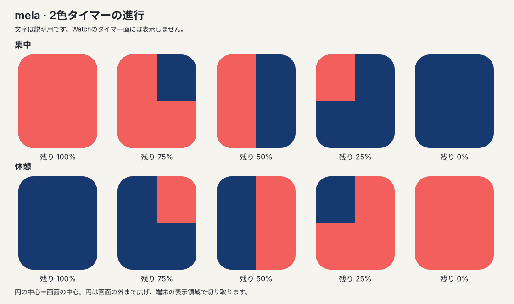

# mela 再構築のプロダクト要件

仕様版 1.0。決定日 2026-10-02。対象は最初の一般利用可能版（以下v1）。**この文書は実装する仕様であり、実装済みの説明ではない。**

melaは、スマートフォンを手に取らず、残り時間を色の広がりで感じながら一つのことに取り組むためのApple Watch専用タイマーである。集中中は赤と青の面だけを見せ、時間の設定や記録は必要なときだけ開く。区切りでは一度知らせ、次に進むタイミングは利用者に委ねる。

実装担当は本書 → [技術設計](timer-design.md) → [受入条件と実装順序](timer-acceptance.md)の順に読む。動作の決定は本書、実現方法は技術設計、完成判定は受入条件を正本とする。既存コードの挙動は新仕様の根拠にしない。

## 1. 確定条件と設計判断

### 利用者が指定した条件

- minee 4の体験をApple Watchで実現する。
- メイン画面はWatch全体の表示領域を使い、円の中心を画面の中心に合わせる。
- 時間は青と赤の2色だけで表す。
- 中心にボタン、軸、数字などの特別なUIを置かない。
- 古い実装を維持するための制約を設けず、アプリを再構築する。

### 本書で決定する条件

- 赤を集中、青を休憩に対応させ、進行中のフェーズの色が時計回りに減る。
- 開始・一時停止・再開・時間変更は、画面をタップして開く操作画面で行う。
- 集中25分・休憩5分を初期値とし、どちらも変更できる。
- 完了後は次のフェーズの開始待ちになる。無人の自動繰り返しはしない。
- 終了通知は1回。音・振動はwatchOSの設定を尊重する。
- Watch内に直近の完了記録を保存し、過去7日分を操作画面から確認できる。
- iPhoneアプリ、アカウント、通信、課金、外部ライブラリをv1の必須条件にしない。

これらは製品としての採用判断であり、minee 4の仕様や効果をそのまま保証するものではない。利用者から変更指示があれば、関連する設計・試験と一緒に改訂する。

## 2. 目的と提供する価値

主な利用者は、作業・読書・勉強などの時間を区切りたいが、残り秒数やスマートフォンの通知に注意を奪われたくない人。Apple Watchを装着し、1〜120分の集中を自分で始める場面を対象にする。

| 解決したいこと | v1の手段 | 価値を損なうため避けること |
| --- | --- | --- |
| 残り時間を見るたびに計算・評価してしまう | 面の変化だけでおおよその残りを見せる | 常時カウントダウン、目盛り、残り1分の警告色 |
| 時間を測るためにスマートフォンを触ってしまう | 設定・操作・通知・記録をWatchで完結 | 必須のiPhone設定、ログイン、クラウド同期 |
| 集中の途中で何度も中断される | 区切りで一度だけ知らせる | 毎分の振動、途中経過の通知、達成演出 |
| 通知を見落とすと次の時間が勝手に進む | 次のフェーズは明示的な操作で開始 | 無限の自動繰り返し、未操作セッションの記録 |
| 取り組んだ時間を振り返れない | 完了した集中を自動で記録 | 手入力の必須化、ランキング、連続日数の圧力 |

[仮説] 数字の常時表示をなくし、区切り以外の刺激を減らすことで、時間確認による注意の逸れを減らせる。医学的な効果や生産性向上率はうたわない。検証方法は[利用体験の評価](timer-acceptance.md#利用体験の評価)に定める。

minee 4公式が示す数字・目盛りに頼らない表示、時間のカスタマイズ、単体利用、自動記録を参照する。反復回数、スマートフォン連携、筐体、中央部品はそのまま移植しない。[minee 4公式](https://mineetimer.com/ja/products/minee-4)

## 3. v1の範囲

| ID | 必須要件 | 完成した状態 |
| --- | --- | --- |
| P01 | Watch単体での利用 | インストール後、通信・iPhoneアプリ・アカウントなしで全機能を使える |
| V01 | 全画面の2色表示 | 画面中心から赤と青の境界が回転し、中心UI・リング・数字を置かない |
| U01 | 操作の分離 | 全画面タップで操作画面を開き、開始・一時停止・再開・やり直し・フェーズ変更ができる |
| S01 | 時間の変更 | 集中1〜120分、休憩1〜60分、1分単位。開始済みの1回には途中適用しない |
| T01 | 一貫したタイマー | 同時に1回だけ実行。期限を基準に完了し、次は手動開始 |
| L01 | 中断からの復元 | バックグラウンド、プロセス終了、再起動後に残り・一時停止・完了を復元できる |
| N01 | 終了通知 | 現在の1回の終了だけをローカル通知として予約し、取消しと失敗を扱う |
| N02 | 権限と通知設定 | 必要になった時に許可を求め、拒否・通知オフでも計時を使える |
| N03 | 触覚 | 操作と終了に役割を限定し、アプリ独自の重複・連続振動を起こさない |
| H01 | 集中の記録 | 完了した集中だけを一度記録し、今日を含む7日分の回数と時間を表示する |
| A01 | アクセシビリティ | VoiceOver、Dynamic Type、Reduce Motionで全操作が使える |
| Q01 | 省電力と復帰 | 常時CPUを動かさず、Always Onと画面再表示時の整合を扱う |
| D01 | データの安全性 | ローカル保存、失敗の明示、記録削除、旧版からの安全な切替ができる |

必須要件の一部を未実装のままv1完成とはしない。実装順序は段階分けできるが、後述の対象外機能を必須へ暗黙に追加しない。

### v1に含めないもの

| 機能 | 今回採用しない理由 | 再検討する条件 |
| --- | --- | --- |
| 自動循環、長休憩、複雑なルーティン | 手動の区切りと単純な復元を優先する | 次フェーズを毎回手動で始める負担が利用評価で確認されたとき |
| 終了後の繰り返し通知、スヌーズ、終了前予告 | 集中を守る目的に対して刺激が増える | 許可・装着・OS設定を確認しても見落としが課題として残るとき |
| タスク名、タグ、目標、連続達成、詳細分析 | Watch上の入力と管理を増やす | 記録の用途が具体的に確認されたとき |
| Complication、Smart Stack widget、App Intents | 常時更新の制約と入口の増加をv1から切り離す | アプリを開く手間が主要な離脱理由になったとき |
| iPhone連携、クラウド、エクスポート | Watch単体で価値が成立する | 機種変更時の引継ぎや長期分析が必要になったとき |
| 音・振動の独自パターン、強制アラーム | OS設定を超える確実性を約束できない | 正当な用途と公開APIで実現可能な要件が確認できたとき |
| 配色テーマ、中央UI、秒数表示の常設 | 2色だけの主画面という指定を守る | 利用者がコンセプト自体の変更を指示したとき |

## 4. タイマーの見た目

### V01 全画面と2色

タイマー面は、丸い枠の内側ではなくWatchの表示領域全体を塗る。角丸は端末の表示形状に従う。アプリ独自の黒い外周、リング、背景の余白、影、グラデーション、輪郭線、中央の円、軸、文字、アイコン、ドット、操作ボタンは置かない。

- 円の中心は、safe area内の中心ではなく、全画面描画領域の幾何学的な中心。
- 扇形は画面の対角線を覆う半径を持たせ、画面の外側を切り取る。円形の中だけを塗らない。
- 2色の意味は固定する。集中の残りは赤、休憩の残りは青。経過した部分は反対色。
- 0%・100%では単色になってよい。「2色だけ」は使用する色の制限であり、常に両方を表示する意味ではない。
- 境界のアンチエイリアスによる中間色は許容する。意図した第3色の領域は作らない。
- 数字は操作画面、記録、アクセシビリティ読み上げに限り使う。

watchOSの時刻・ステータス・通知・権限ダイアログはOS管理の表示であり、この2色制約の対象外。公開APIで消せると仮定せず、隠すための独自windowや非公開APIを使わない。アプリが描く面はそれらの背面まで広げる。システム表示との実際の重なりは実機で検証する。[Appleの画面サイズとsafe area](https://developer.apple.com/documentation/watchos-apps/supporting-multiple-watch-sizes)

### 色と進行方向

| 表示環境 | 集中の赤 | 休憩の青 |
| --- | --- | --- |
| 通常表示 | sRGB `#F25F5C` | sRGB `#163A70` |
| Always Onの低輝度表示 | sRGB `#A9413E` | sRGB `#07101F` |

これは本製品の初期配色であり、minee 4から抽出した色ではない。通常表示の2色間コントラスト比は約3.51、低輝度用は約3.18（sRGB相対輝度による計算値）。OSによる減光・色調整後の見やすさを保証する数値ではない。実機で見分けにくければ赤・青という意味を保ったまま両方の色定数と見本を更新する。

12時の方向から時計回りに経過部分が増える。25分でも60分でも、一つのフェーズの開始から終了までが1回転。表示は時計の時刻ではなく、設定時間に対する残り割合である。

| 残り割合 | 集中中の面 | 休憩中の面 |
| --- | --- | --- |
| 100% | 全面が赤 | 全面が青 |
| 75% | 右上90度だけ青、残りが赤 | 右上90度だけ赤、残りが青 |
| 50% | 左半分が赤、右半分が青 | 左半分が青、右半分が赤 |
| 25% | 左上90度だけ赤、残りが青 | 左上90度だけ青、残りが赤 |
| 0% | 全面が青。休憩の開始待ちへ | 全面が赤。集中の開始待ちへ |

Watchは長方形を切り取って表示するため、扇形の**角度の割合**が残り時間を表す。赤・青のピクセル面積の割合が常に残り時間と一致するとは説明しない。具体的な座標式は[技術設計](timer-design.md#描画の計算)に定める。

一時停止中はその位置で静止する。点滅・呼吸アニメーション・終了時の拡大や色反転は行わない。待機中と開始直後、終了直後と次の待機が同じ単色に見えるのは意図した仕様であり、状態は操作画面で確認する。

## 5. 画面と操作

### 初回案内

初回だけ1画面で「赤は集中、青は休憩」「色が減ると残り時間も減る」「画面をタップすると操作できます」を示す。数字や操作の説明はこの案内に置き、主画面には残さない。「始める」で操作画面へ進み、案内の確認済み状態を保存する。設定から再表示できる。

通知のOS許可要求は起動直後に出さない。最初に通知を使ってタイマーを開始するときに理由を示し、その場で要求する。[Appleの通知許可方針](https://developer.apple.com/documentation/usernotifications/asking-permission-to-use-notifications)

### 起動と復帰

| 状況 | 開く画面 |
| --- | --- |
| 初回起動 | 初回案内 |
| 通常起動・前景復帰時に計時中 | 最新の2色タイマー面 |
| 通常起動・前景復帰時に待機または一時停止中 | 状態を示す操作画面。閉じれば2色面 |
| 前景で見ている間に終了 | 2色面が次のフェーズの単色になる。操作画面を勝手に開かない |
| 操作画面や設定を開いている間に終了 | 表示中の画面を保ち、操作画面の状態だけ最新にする |
| 通知本文をタップ | 期限と識別子を照合して現在の操作画面を開く |
| 通知の「休憩を開始」「集中を開始」 | まだ有効な次フェーズなら開始して2色面へ。古い通知なら開始せず現在の操作画面へ |

権限ダイアログによる短いinactive遷移で画面や編集中の内容を勝手に閉じない。通知や起動からの遷移と、単なる表示の減光を区別する。

### U01 操作画面

主画面のどこかを1回タップすると、標準のsheetで操作画面を開く。タップそのものでは開始・停止しない。隠しlong press・double tap・Force Touchに依存しない。Digital Crownは主画面の残り時間を変更せず、操作画面でのスクロールと標準Pickerに使う。

操作画面は通常のSwiftUI部品を使ってよい。主画面の2色制約を持ち込まない。上から現在フェーズ、状態、時間、主操作、補助操作、設定・記録への入口を並べ、スクロール可能にする。閉じる操作を提供する。

| 状態 | 時間表示 | 主操作 | 補助操作 |
| --- | --- | --- | --- |
| 集中の開始待ち | 「集中 25分」など設定時間 | 「集中を開始」 | 「休憩に切り替える」 |
| 休憩の開始待ち | 「休憩 5分」など設定時間 | 「休憩を開始」 | 「集中に切り替える」 |
| 計時中 | 「集中中／休憩中」、残り `mm:ss`。1時間以上は `h:mm:ss` | 「一時停止」 | 「この回をやり直す」「休憩／集中に切り替える」 |
| 一時停止中 | 「一時停止中」、固定された残り時間 | 「再開」 | 「この回をやり直す」「休憩／集中に切り替える」 |
| 完了後の開始待ち | 「集中が終わりました／休憩が終わりました」と次の設定時間 | 次のフェーズを開始 | 完了した側のフェーズに切り替える |

「開始」「再開」が成功するとsheetを閉じる。「一時停止」はsheetを開いたままにする。表示は秒を切り上げ、0未満を出さない。開始・再開の処理中は重複操作を無効にし、保存が成功する前に開始成功の触覚を出さない。

開始済みの「やり直す」「切り替える」は「この回の途中経過は記録されません」と確認し、既定の選択は取消しにする。「やり直す」は同じフェーズの新しい開始待ち、「切り替える」は反対フェーズの開始待ちへ移り、自動で開始しない。開始待ちでの切替には失う進行がないので確認しない。やり直し時は現在の設定時間を使う。

### S01 設定

| 項目 | 初期値と範囲 | 適用時点 |
| --- | --- | --- |
| 集中時間 | 25分、1〜120分、整数 | 次に新しく開始する集中から |
| 休憩時間 | 5分、1〜60分、整数 | 次に新しく開始する休憩から |
| 終了のお知らせ | オン | 現在の計時にも適用し、予約を登録・取消しする |
| 操作時の触覚 | オン | 次の開始・再開・一時停止から |
| 使い方 | 初回案内を表示 | 開いたとき |
| 記録を削除 | 確認付きの操作 | 保存成功時。現在のタイマーと設定は残す |

時間Pickerは1分単位で、保存と取消しを用意する。入力中の値は下書きであり、取消し・画面を閉じる・アプリ終了で確定しない。通知や触覚のtoggleは変更ごとに保存する。0分、範囲外、NaN、不正な復元データを実行可能な時間として扱わない。

設定の説明に「時間の変更は次の回から反映されます」を示す。計時中・一時停止中の元の設定時間と残り時間は固定する。

## 6. 時間とフェーズ

T01の「1回」は、利用者が明示的に開始してから完了または破棄するまで。同時に複数のタイマーは持たない。

- 集中 → 休憩 → 集中の順。終了時に反対フェーズの開始待ちへ移る。
- 画面を閉じる、別アプリを使う、腕を下ろす、端末をロックすることは一時停止ではない。
- 一時停止中の時間は消費しない。期限が過ぎた状態で押された「一時停止」は完了を先に確定する。
- 完了は有効な残り時間が0以下になった場合だけ。やり直し・切替を完了として数えない。
- 長時間アプリを開かなかった場合でも、開始した1回だけを完了扱いにし、休憩や次の集中を架空に生成しない。
- タイマー面の更新回数を時間の正本にしない。描画が止まっても期限は進む。
- 通常のバックグラウンド復帰、プロセス終了、Watch再起動から復元する。OSが処理を再開した時に状態を確定し、バックグラウンドでアプリが必ず動くとは約束しない。

同一プロセス内はスリープ中も進む時計を用いる。プロセス終了・再起動をまたぐ復元は保存した終了日時を使う。その間の手動の時計変更については、経過時間を完全には復元できない。復元した残りを保存時の残り以内に制限する。タイムゾーン変更だけで残り時間を変えない。[時刻と復元の詳細](timer-design.md#時刻と復元)

## 7. 終了のお知らせと触覚

### N01 通知の基本

終了のお知らせがオンで通知許可がある場合、開始・再開時に**その1回の終了通知だけ**を予約する。通常の通知（interruption levelはactive）を使い、Time Sensitive・Critical Alert・無音音声再生・運動セッションなどで集中モードや実行制限を回避しない。

| 終了したもの | タイトル | 本文 | 明示的な通知アクション |
| --- | --- | --- | --- |
| 集中 | 集中の時間が終わりました | ひと息つくタイミングです。休憩は自分のタイミングで始められます。 | 休憩を開始 |
| 休憩 | 休憩の時間が終わりました | 準備ができたら、次の集中を始められます。 | 集中を開始 |

既定の通知本文タップは操作画面を開くだけ。アクションはforegroundでアプリを開き、保存状態と通知を照合してから開始する。通知を閉じるだけでは計時状態を変えない。通知から始めた新しい回も、その操作があった時刻から測る。

### N02 許可と利用者への説明

初めて通知付きで開始するとき、「画面を閉じても区切りを知らせるため、通知を使います。音と振動はWatchの設定に従います」と示す。「通知を使う」でalertとsoundを要求し、「今は使わない」で終了のお知らせをオフにして開始する。要求中の時間はセッションに含めない。

拒否された場合も開始を続ける。OSの許可要求を繰り返さない。設定に通知の状態と、Watch／iPhone側の通知設定を確認する説明を表示する。設定を開く独自URLの存在を仮定しない。通知権限と「音が許可されているか」を前景復帰・開始・再開時に読み直す。[Appleの許可と設定取得](https://developer.apple.com/documentation/usernotifications/asking-permission-to-use-notifications)

| 状況 | アプリ側の挙動 | 操作画面での説明 |
| --- | --- | --- |
| 終了のお知らせがオフ | 通知を予約せず、終了時の独自触覚もしない | 終了のお知らせはオフです |
| OSの通知許可がない | 計時継続。前景でそのまま終了を迎えた場合のみ触覚を試みる | 画面を閉じている間は終了をお知らせできません |
| 許可あり・予約成功 | システムの終了通知を利用 | 終了のお知らせはWatchの設定に従います |
| 音がOSで無効 | その設定を尊重。独自の音・振動で迂回しない | 音と振動はWatchの設定を確認してください |
| 予約失敗が確定 | 計時継続。再試行を操作画面に用意 | 終了のお知らせを設定できませんでした |
| 許可要求自体がエラー | 拒否と区別し、開始を続ける。後で再試行できる | 通知の状態を確認できませんでした |

エラーで主画面に第3色のアイコンや常設バナーを追加しない。開始時に問題が判明した場合は操作画面内で一度示し、「このまま使う」で2色面へ進める。復帰後に判明した問題は次に操作画面を開いたときに示す。

### N03 触覚の役割と重複防止

| 場面 | アプリの触覚 | 条件 |
| --- | --- | --- |
| 開始・再開の成功 | WatchKitのstartを1回 | 操作時の触覚オン、アプリactive |
| 一時停止の成功 | WatchKitのstopを1回 | 同上 |
| 通常の終了通知 | OSに任せる。アプリから追加の終了振動は出さない | 有効な通知予約がある場合 |
| 通知が拒否／登録失敗し、表示中に終了 | successを1回試みる | 終了のお知らせオン、activeのまま期限を迎えた場合だけ |
| 復帰して過去の完了を発見 | 独自触覚なし | 古い区切りを改めて鳴らさない |
| 途中経過、設定の保存、画面タップ、記録閲覧 | 独自触覚なし | 標準部品・Digital CrownのOS側触覚はそのまま |

前景で通知が届く場合は通知delegateでsoundのみを提示し、タイマー面にアプリ独自の完了ダイアログを出さない。音が無効であれば面の変化だけになる。バックグラウンドでの表示と音・触覚はOSに任せる。予約結果が未確定の間は独自の終了振動を重ねない。[Appleのforeground通知処理](https://developer.apple.com/documentation/usernotifications/unusernotificationcenterdelegate/usernotificationcenter(_:willpresent:withcompletionhandler:))

アプリから触覚の強さや通知音の音量を制御する設定は設けない。「必ず振動する」「マナーモードを無視して鳴る」「バックグラウンドで任意の振動パターンが続く」とは説明しない。WatchKitのplayは通常、inactive／backgroundでは働かない。消音時にも通知の触覚を受けられるOS設定があるが、装着・触覚設定・集中モードなどによって結果は変わる。[WatchKit play](https://developer.apple.com/documentation/watchkit/wkinterfacedevice/play(_:))、[Apple Watchの音と触覚の設定](https://support.apple.com/en-us/108368)

通知はローカルで予約するためネットワーク不要。ただしOSの配信時刻・Focus・ロック・装着状態までアプリが保証するものではない。通知の取消しと配信が同時なら、OSが既に表示した通知を遡って取り消せない場合がある。アプリは古い通知から新しい回を誤開始しないことを保証する。

## 8. H01 記録

記録画面は操作画面から任意に開く。「完了した集中」を見出しにし、今日の完了回数・合計時間と、今日を含む過去7日の日別値を新しい日から表示する。0件の日も表示する。時間は分単位、60分以上は時間と分で表示する。記録がない場合は「完了した集中がここに記録されます」と示す。

- 自然完了した集中だけを、セッションIDごとに一度保存する。
- 時間はその回に確定していた集中時間。一時停止は含めない。途中でやめた時間を「完了した集中時間」に加えない。
- 休憩、フェーズ切替、やり直し、未開始の回は集計しない。中断を失敗として表示しない。
- 画面を閉じて完了していた場合、次回起動で記録を確定する。記録日時は復帰時刻ではなく終了期限。
- 日付の区分は表示時点の端末のCalendarとタイムゾーン。日をまたぐ集中は終了した日の記録とする。旅行などでタイムゾーンを変えると所属日が変わることを許容する。
- 表示は7日分。日付変更への余裕を含め、内部の個別記録は終了から14日まで保持し、起動または保存時に古い記録を削除する。タイマー進行を保存するデータはこの削除対象にしない。
- 「記録を削除」は確認のうえ過去の記録をすべて消す。進行中の回は維持し、その後に完了した分は新たに記録する。
- 端末外への送信・広告・分析SDK・独自クラウドバックアップは行わない。アンインストール後や新しいWatchでの記録復元はv1の保証外。

## 9. アクセシビリティと電力

### A01 アクセシビリティ

主画面全体をVoiceOverで1つの操作要素として扱う。例は「集中中、残り12分30秒。操作を開く」。状態・フェーズ・残り時間を色以外で把握できるようにし、通常のactivateで操作画面を開く。数字の読み上げは視覚上の2色制約を破らない。毎秒の自動読み上げはしない。

操作画面はテキスト付きButtonと標準Pickerを用い、色だけで破棄・開始を区別しない。Dynamic Type最大時はスクロールしてすべての操作に到達できる。独自の操作領域は44×44pt以上を設計基準とする。Reduce Motionでは補間アニメーションを行わない。左右の手首・画面方向・利用者の色調整で操作が破綻しないよう実機確認する。

色を見分けられない場合でも操作画面とVoiceOverで計時機能を使える。ただし色覚のあらゆる状態で主画面だけが同じ情報量になるとは約束しない。パターンや第3色を無断で追加して解決しない。

### Q01 Always Onと電池

通常時の描画更新は最大1秒に1回を基準にする。最後の数秒も更新頻度や刺激を増やさない。低輝度時は低輝度用2色を使い、OSの低い更新頻度に従う。腕を上げたら待たずに最新の残りへ戻す。

Always On非対応、オフ、省電力、OSによる時計画面への復帰は許容する。画面の常時点灯や、アプリが永久に最前面に残ることを約束しない。描画の更新間隔を短く指定しても実際の更新はOSに抑えられる。[TimelineView](https://developer.apple.com/documentation/swiftui/timelineview)、[isLuminanceReduced](https://developer.apple.com/documentation/swiftui/environmentvalues/isluminancereduced)

バックグラウンドの常時実行を目的に、運動・位置情報・音声・Smart Alarmを偽装しない。Extended Runtime Sessionは用途に合った種類を選ぶ仕組みであり、本アプリの汎用集中タイマーでは採用しない。[AppleのExtended Runtime Session](https://developer.apple.com/documentation/watchkit/using-extended-runtime-sessions)

## 10. 仕様の変更と完了の扱い

この依頼の成果物は要件・設計・受入文書であり、旧アプリの削除や実装完了ではない。コードの再構築は[実装順序](timer-acceptance.md#実装順序)に従って進める。既存の開発ハーネス、保護設定、bundle ID、署名資産を「作り直し」を理由に消さない。

日常利用に必要な動作、失敗時の挙動、基本の設定値は本書で決定済み。実装者が後から仕様を発明する必要はない。実機でしか決められない表示・通知・触覚の成立確認は[検証ゲート](timer-acceptance.md#実機検証で確認する成立条件)として管理し、不成立なら代替案と影響を示して仕様を改訂する。未検証を実装済み・合格と記載しない。
