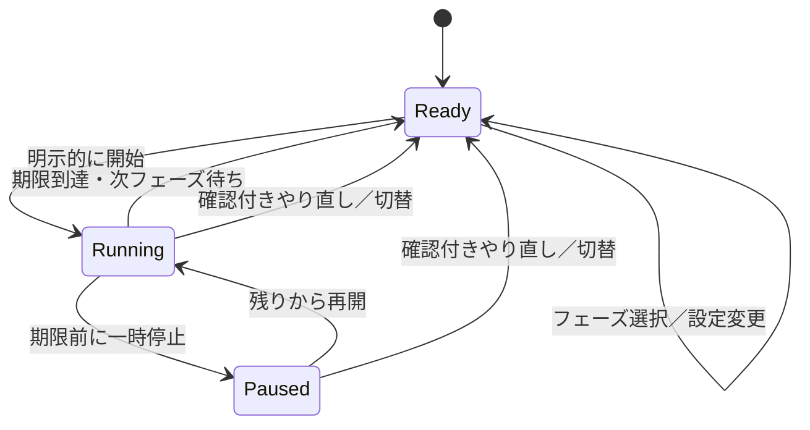

# mela タイマー再構築の技術設計

仕様版1.0、2026-10-02。[プロダクト要件](requirements.md)を実装するための設計。以下の型・ファイル・テストをv1として実装している。実装の有無と、実機・利用体験の受入合格は区別する。

## 採用する技術

| 項目 | 採用判断 |
| --- | --- |
| アプリ | Watch-only。既存のbundle IDとXcodeプロジェクトを維持し、アプリsourceを置換する |
| 最低OS | watchOS 26.4を維持。新規実装もこの範囲で成立する公開APIに限定 |
| 検証する新しいOS | watchOS 27.xの安定版。実装開始時の正式SDK・OS buildを記録する |
| 言語 | Swift 6言語モード（`SWIFT_VERSION = 6.0`）。コンパイラの6.4とは別の値 |
| UIと状態 | SwiftUI、Observation、`@MainActor @Observable`のモデルを1つ所有 |
| 計時 | FoundationのDateとSwiftのContinuousClock。描画はTimelineView |
| 通知と触覚 | UserNotifications、WatchKit。リモート通知やサーバーは使わない |
| 保存 | Codableの単一スナップショットをApplication Supportへatomic write |
| テスト | XcodeのwatchOS unit test targetにSwift Testing。GUI確認は別に行う |
| 追加依存 | なし。DB、DIコンテナ、Rx、独自イベントバスは導入しない |

2026-10-02にローカルでXcode 27.0（27A266a）とApple Swift 6.4を確認した。ディレクトリ名だけでRCと判定しない。これは環境の確認であり、新アプリのbuild成功を意味しない。[AppleのSDK要件](https://developer.apple.com/xcode/system-requirements/)、[Swift 6.4](https://www.swift.org/blog/swift-6.4-released/)

既存[Issue #3](https://github.com/shinma06/mela-watch-timer/issues/3)とは、Swift 6移行、Swift Concurrency、SDK互換、build/test整備を共有する。そこにある「旧リング・数値・固定25/5・スキップ時カウントを保持する」前提は本仕様で置き換える。CLI・Actions・Pythonの更新はIssue #3の範囲であり、本アプリの再構築を理由に端末へ一括インストールしない。実装開始時にIssue #3の担当と範囲を合わせ、同じsourceへの二重writerを作らない。

## 実装の境界

既存の小さなアプリに合わせ、必要な責務だけを分ける。下記は配置の目安であり、1型1ファイルのために分割しない。

| source | 責務 |
| --- | --- |
| `mela_watch_timerApp.swift` | モデルの所有、通知delegateの生存期間、起動時ロード、scenePhaseの転送 |
| `TimerState.swift` | Codable/Sendableの値型、状態遷移、残り割合、入力検証、記録集計 |
| `TimerModel.swift` | MainActor上の操作直列化、時計の参照、保存と副作用の調停、画面向け状態 |
| `TimerServices.swift` | 具象のStateStore actor、通知処理、触覚の呼出し。大きくなるまで分割しない |
| `ContentView.swift` | 2色のShape、TimelineView、操作sheet、設定、記録のView |
| `TimerTests/` | 状態・保存・通知競合の実行可能な回帰テスト。projectへtargetを追加 |

モデルはSwiftUI Viewを参照しない。純粋な状態計算はWatchKit／UserNotificationsをimportしない。時計、保存先、通知のadd/removeの置換点は小さなinitializer引数やclosureで用意し、テストのためだけに実装が1つのprotocol階層を作らない。

モデルの観測プロパティは`private(set)`にし、Viewから直接書き換えない。Appで1回生成したモデルを全画面に渡し、Viewの再生成・sheet表示で新しいタイマーを作らない。

## 保存するデータ

正本は`Application Support/mela/state-v1.json`。DateはUnix epochからのミリ秒、時間量は秒の有限なDoubleで保存する。表示文言、Viewの状態、OSの許可状態、ContinuousClock.Instant、Task、エラーのraw logは保存しない。

| データ | 必須の内容 |
| --- | --- |
| `schemaVersion` | 1。不明な新しい版を既定値で上書きしない |
| `settings` | 集中分、休憩分、終了のお知らせ、操作時の触覚、初回案内の確認済み |
| `timer` | ready / running / paused、現在または次のphase、下記Session、readyの理由 |
| `Session` | sessionID（UUID）、phase、開始時に確定したduration、最初のstartedAt、保存時の残り、終了日時（runningのみ） |
| `readyReason` | initial / userSelection / completed(sessionID)。通知からの開始可否を決める |
| `lastCompletion` | 最後に完了した回のsessionID、phase、duration、endedAt、通知token。休憩の完了も保持 |
| `notificationIntent` | 予約するsessionID、毎回新しいtoken（UUID）、終了日時、phase。通知不要ならnil |
| `focusRecords` | 自然完了した集中のsessionID、duration、endedAt。終了から14日分まで |

`sessionID`は開始で作り、pause/resumeで変えない。通知のtokenは新規開始・再開・予約内容の変更時に更新する。通知APIへ同じIDを使い回して古いaddの結果で新しい予約を消す実装を避ける。

### 状態の不変条件

- readyは進行中Sessionを持たない。表示上の残りは次フェーズの設定時間そのもの。
- runningはSession、正のduration、有効な期限を持つ。保存時の残りは`0 < remaining <= duration`。
- pausedはSessionと正の残りを持つが、実行中の期限と通知予約を持たない。
- phaseはfocus/restのいずれか。設定時間は製品の範囲内の整数分。
- Sessionのdurationは開始時の値。設定変更で分母を変えない。
- 同じsessionIDの集中記録は最大1つ。記録のdurationは正で、集中の上限以下。
- 完了後のreadyが持つnotificationIntentは、そのlastCompletionの通知を受け取るためのものだけ。過去分を新規予約しない。
- 保存された日時・時間量が非有限、必須フィールドが欠損、不正な状態の組合せなら復元失敗として扱う。

JSONには明示的なschemaVersionを持たせる。将来のmigrationは版ごとに定義し、decode失敗を`try?`で消して空データに置き換えない。

## 状態遷移

各操作の処理前に現在時刻で完了を照合する。runningの残りが0以下なら、要求されたpauseや破棄より先に完了を一度確定する。イベントはMainActorの単一の処理経路で扱う。



| 現在状態と入力 | 次の状態 | 記録・通知・表示の処理 |
| --- | --- | --- |
| ready + start | 同じphaseのrunning | 新しいsessionIDとtoken。設定時間を固定し、保存後に予約、sheetを閉じる |
| running + pause（期限前） | 同じSessionのpaused | 入力処理時点で残りを再計算。保存後に通知取消し、触覚stop |
| paused + resume | 同じSessionのrunning | 今から残りだけを測る。新token。保存後に予約、触覚start |
| running + 期限到達 | 次phaseのready(completed) | 集中なら記録を1件追加。lastCompletion更新。期限の通知は受信可能のまま残す |
| running/paused + やり直し確認 | 同じphaseのready(userSelection) | 記録なし。元Sessionと通知を破棄。現在の設定時間を表示 |
| running/paused + 切替確認 | 反対phaseのready(userSelection) | 同上。新しい回は開始しない |
| ready + 切替 | 反対phaseのready(userSelection) | 完了通知の開始アクションを無効化し、残った予約・配信済み通知を除去 |
| running/paused + 時間設定保存 | 現在状態を維持 | settingsだけ更新。Sessionと残り・比率を維持 |
| 任意 + 終了のお知らせオフ | 現在状態を維持 | intentと通知tokenの有効性を解除し、pendingとdeliveredを取消し |
| running + 終了のお知らせオン | 現在状態を維持 | 必要なら許可要求。残りが正なら新tokenで残りだけ予約 |
| ready/paused + 終了のお知らせオン | 現在状態を維持 | 設定のみ。過去の完了を鳴らさず、次の開始・再開で予約 |
| 任意 + 古い／重複したイベント | 状態を維持 | 別Sessionのpause、完了、通知結果を適用しない |

「start」はreadyに対してだけ有効。runningで再度startを受けても期限を延長しない。pausedでstartを受けても別Sessionを作らない。再開は専用操作にする。

## 時刻と復元

### 実行中

開始・再開時に同時にwall clockのDateとContinuousClockのanchorを取る。セッションの残りを`r0`、anchorからの経過を`elapsed`とすると、計算上の残りは`r0 - elapsed`。画面へは`max(0, remaining)`を出す。毎秒1を引く方式にはしない。

ContinuousClockはプロセス内で使うスリープを含む経過時間の基準。Instantは別プロセス・再起動後の永続化に使えないため、同時に`deadline = wallNow + r0`を保存する。[Swift ContinuousClock](https://developer.apple.com/documentation/swift/continuousclock)

アプリがactiveのときだけ完了確認用Taskを最大1つ持つ。期限までsleepし、復帰した時点で時刻を再確認する。Taskの起床が正確な期限を保証するとは扱わない。scenePhaseがactiveになった時と利用者操作の直前にも同じ完了処理を通す。通知delegateもこの処理を通す。ViewのbodyやShapeのpath内から状態変更・保存・通知を行わない。

描画用TimelineViewと完了確認Taskは役割が別。前者は面を描き直し、後者は記録と次の待機状態を確定する。OSにsuspendされた場合はどちらの定刻実行にも依存せず、保存期限と予約済み通知で復帰できるようにする。

### 再表示・プロセス再生成

| 状況 | 残りの基準 | 処理 |
| --- | --- | --- |
| 同じプロセスの前景復帰 | 既存のContinuousClock anchor | 経過を反映し、0以下なら1回完了 |
| 新しいプロセスでrunningを読む | `deadline - wallNow` | 0以下なら1回完了。正なら保存時の残りを上限にclampし、新anchorを作る |
| pausedを読む | 保存した残り | 経過を引かずにpausedを復元 |
| readyを読む | 現在の設定時間 | 自動開始しない |
| 長い不在の後 | 同上 | 次の休憩・集中を追計算せず、保存された1回だけ確定 |

プロセス再生成時は、期限・記録・readyへの遷移を同じsnapshotに保存してから操作を許可する。通知から起動した場合もロード→時刻照合→通知ID照合→操作の順を守る。

完了日時は、復元時は保存されたdeadline。同一プロセスでは遅れた確認時刻から期限後の経過を差し引いた実効期限にする。復帰した時刻を記録のendedAtにしない。

### 時計変更

- 同一プロセスの手動時刻変更で残り時間を増減させない。ContinuousClockを優先する。
- active復帰または操作時に、`wallNow + monotonicRemaining`と保存deadlineの差が2秒を超えたら、保存期限と未来の通知を新tokenで合わせ直す。これは異常な時計差を検出する閾値で、通常の計時精度の許容差ではない。
- タイムゾーン・夏時間の変更はDateの絶対時刻を変えない。画面・日別集計の表示だけに反映する。
- プロセス終了と手動時刻変更が重なった場合は保存期限を基準にし、`remaining = min(savedRemaining, max(0, deadline - now))`。前進なら早い完了、後退なら残りが増えたように見える場合があるが、保存した残りを超えて延長しない。
- OS側の相対時刻通知が手動時計変更時にどう配信されるかは実機検証事項。独自の通知が来ただけで期限前のSessionを完了させない。

最後の制約を取り除くためのboot識別・低水準の永続時計はv1には導入しない。通常のスリープ・再起動復元とは分けて受入結果に記録する。

## 永続化とエラー処理

StateStore actorが1つのファイルを扱い、JSON encode→atomic writeを行う。複数のUserDefaults keyへ進行・記録をばらばらに保存しない。設定とタイマーと記録が違う世代になるのを避ける。

1. 操作を受けたモデルは期限を確認し、次のsnapshotを値として作る。
2. 状態変更中は次の状態変更コマンドを直列化する。ボタンの重複tapは無効にする。await中のMainActor再入で古いsnapshotが上書きされないようにする。
3. snapshotを保存する。成功後にモデルの観測状態を更新する。
4. 保存した意図に従って通知を登録・取消しし、必要なら触覚を出す。
5. 通知結果が遅れて返った場合はtokenを照合する。保存した最新状態を過去へ戻さない。

書込みは開始、pause、resume、完了、やり直し、切替、設定確定、履歴削除、時計補正のときだけ。秒ごとの描画では書き込まない。OS終了直前のonDisappearだけを保存の契機にしない。

| 失敗 | 動作 |
| --- | --- |
| 初回でファイルなし | 既定値で初期化。破損扱いにしない |
| 読込不可・decode不正 | 自動上書きせず、操作画面で「保存データを読み込めません」と再試行・確認付き初期化を提示 |
| 新しいschemaVersion | 互換性エラーとして保持。新しいアプリで開く案内と、明示的な初期化の選択を提示 |
| 初期化を確認 | 元データを可能なら非公開の退避ファイルへ保存してから新規作成。失敗したら元データを消さない |
| 開始／再開の保存失敗 | 旧ready／pausedを維持。計時・通知・開始成功の触覚を始めない |
| pause／破棄の保存失敗 | 旧running／pausedを維持し、実際の状態を明示。「一時停止を保存できず、タイマーは継続しています」など |
| 完了の保存失敗 | 面は0まで進め、完了の保存待ちとして新規開始を禁止。予約済み通知は維持。前景復帰または明示的再試行で同じIDの完了を保存 |
| 設定・記録削除の保存失敗 | 変更前の状態を維持し、成功と表示しない |
| 通知の登録失敗 | 保存されたrunningを維持。通知不可の状態と再試行を表示。保存失敗と混同しない |

完了と履歴追加をatomicに保存するので、「履歴だけ増えてrunningが残り、復帰で再追加する」状態を作らない。完了の再処理はsessionIDで冪等にする。エラー表示中も操作sheetを閉じて2色面を見ることはできるが、未解決の保存失敗を別Sessionの開始で隠さない。

退避・ログ・保存データはアプリのsandbox内に置く。通知payloadやローカル時刻記録をリポジトリや分析サービスへ送らない。バックアップからの復元は、restore時にも同じ期限照合とschema検証を通す。

## 通知の予約と競合

### 予約の内容

- `UNTimeIntervalNotificationTrigger`、`repeats = false`。通知登録直前に残りを再計算し、有限かつ正の値だけを渡す。0以下なら通知を新規登録せず完了照合する。[Appleのtrigger条件](https://developer.apple.com/documentation/usernotifications/untimeintervalnotificationtrigger/init(timeinterval:repeats:))
- request IDは`mela.session.<sessionID>.<token>`。アプリが作ったIDだけを取消対象にする。
- contentは要件書のタイトル・本文、`sound = .default`、activeのinterruption level。badgeは使用しない。
- categoryは集中終了と休憩終了の2つ。アクションIDは`START_REST`／`START_FOCUS`、いずれもforeground。
- userInfoはpayloadVersion、sessionID、token、完了したphase。受信時は版・UUID・enumを検証し、不正な値で操作しない。
- 許可状態とsound設定はOSから都度取得する。保存済みの許可フラグを正本にしない。

システムに登録済みのローカル通知は、通常、アプリが動いていなくてもOSが配信を担当する。通知が表示されたことは、アプリ内の記録更新が実行された証拠ではない。[Appleのローカル通知](https://developer.apple.com/documentation/usernotifications/scheduling-a-notification-locally-from-your-app)

### 通知処理の順序

Notification処理は単一のworkerで直列化する。actorであってもawait中に別操作が入ることを前提に、最後に保存したintentを都度照合する。

1. 古いアプリ所有IDのpendingとdeliveredを除去する。現在のintentと一致するIDは残す。
2. runningかつ未来のintentで、許可があり、まだ該当pendingがなければ予約する。
3. `add`をawaitした後、captured tokenが最新intentと一致するか確認する。
4. 不一致ならcaptured IDだけをremoveする。最新IDをまとめて消さない。単なるTask.cancelでaddが取消されたと仮定しない。
5. 一致して成功なら予約成功として表示する。失敗なら現在の回の通知エラーを表示する。
6. 次の状態変更があれば、その最新intentへ収束させる。

pause、やり直し、切替、通知オフ、新しい回の開始では元tokenを無効にしてから除去する。成功した取消しの後に遅いaddが復活しても、上記の補償削除で消えることをテストする。

予約失敗への自動試行は、開始・再開・active復帰・設定オンを契機に各1回だけ。明示的な「再試行」も1回。常時リトライや指数バックオフ用のバックグラウンド処理は設けない。

### 期限到達時に通知を消さない

前景の完了Taskが先に動いても、その期限に予約した通知を即removeしない。完了したIDをlastCompletionとintentに保持し、delegateがその1件を受け取れるようにする。これは新しい予約ではない。

起動時に期限が過ぎている場合も、同じ通知を再addして過去の終了を鳴らし直さない。既にpending/deliveredの該当IDがあればそのまま扱い、新しい回・やり直し・フェーズ選択・通知オフで除去する。保持される過去のIDは最後の1件だけ。

### 前景通知と触覚

delegateはアプリの起動時から保持する。willPresentを受けたらモデルへ渡し、sessionID/tokenと期限を照合する。有効な完了ならsoundのみを返し、アプリ独自のsuccessを重ねない。不正・古い・期限前なら提示を抑止する。期限前の有効Sessionなら残りを再計算して新tokenで予約し直す。callbackのcompletion handlerはどの分岐でも1回だけ呼ぶ。

通知なしのfallback触覚は、終了のお知らせオン、予約不可が確定、activeのまま期限を迎えたという条件がすべて成立したときだけ。復帰・起動時の追認や予約処理中には出さない。同じsessionIDのfallback要求はモデル内で1回まで。WatchKitでの成功そのものはOS・装着に依存する。

Foreground／backgroundの境界でOSが既に配信を始めた通知はアプリだけで完全に制御できない。app側が複数の通知・触覚を生成しないことと、OSの配信結果は区別して検証する。

### 通知アクション

通知本文タップは現在の操作画面へ。`START_REST`／`START_FOCUS`は、以下がすべて成立した場合だけ実行する。

1. データのロードと期限照合が成功している。
2. 現在はready(completed)で、そのsessionIDがpayloadと一致する。
3. lastCompletionと有効な通知tokenが一致する。
4. アクションの次phaseが現在の待機phaseと一致する。

成功すれば通常のstartと同じ保存・通知・触覚経路を通す。二重タップの2回目、通知後に別の回を開始済み、pause後の古い通知、通知オフで無効化された通知は新規開始しない。現在の操作画面を開くだけにする。

## 描画の計算

全画面の描画領域を幅W、高さHとする。safe areaを無視した背景側のGeometryReaderで測り、操作sheetはsafe area内に置く。

```text
center = (W / 2, H / 2)
radius = hypot(W, H) / 2 + 1pt
remainingRatio = clamp(remaining / sessionDuration, 0, 1)
elapsedAngle = 2π × (1 - remainingRatio)

画面座標で角度θの点 = center + (radius × sinθ, -radius × cosθ)
θ = 0 は12時、正の向きは時計回り
残りの扇形 = elapsedAngle から 2π まで
```

反対色で全面を塗り、現在phaseの残り扇形を重ねて画面端でclipする。r=0は扇形なし、r=1は全面塗りの特別扱いとし、ゼロ角度のarcでfull circleを描こうとしない。中心を含むpathだが、中心に円・線端・ボタンを追加しない。

TimelineViewはactive時に1秒を希望間隔として描画し、OSのcadenceが遅ければそれに従う。純粋な読み取りでその時点の残りを求める。paused/readyは不要なperiodic更新を止める。角度を1秒かけて補間することはv1では不要。Reduce Motionと低輝度では補間を追加しない。

Always Onでは色の組だけを変更し、別のリング・中央時計・黒背景へ置き換えない。色覚調整やOSの減光でRGB値が変わることは許容する。製品の2色制約はアプリが用意する意味上の色と形に適用する。

## Swift Concurrencyとライフサイクル

- UI操作・モデル・完了の確定はMainActorに統一する。保存actorとの間はSendableの値型snapshotを渡す。
- 純粋な値型とCodable処理は既定のMainActor分離に引きずられないよう、採用コンパイラで明示的な分離を設定・検証する。
- 状態変更コマンドは順序を保って処理する。通知処理の待ち時間でpauseや取消しのUIを止めない。
- 現在のSession用の完了Taskを最大1つにする。pause、完了、破棄、inactive/background移行で取消し、active復帰で再照合して必要なら作り直す。
- 各Taskはcaptured sessionID/tokenを照合し、取消し後の遅いcallbackを無視する。Taskがモデルを無期限に保持しないよう終了経路を持たせる。
- actorからのcallbackは安全な方法でMainActorへ渡す。`MainActor.assumeIsolated`、`@unchecked Sendable`、警告の一括抑制で移行を通さない。
- `.onAppear`だけで復帰を検知しない。scenePhaseのactiveと起動時ロードを入口にする。
- 許可ダイアログによるinactiveからactiveは、表示中の操作・設定を保つ。backgroundからの復帰時にのみ起動画面ルールを適用する。
- 通知payloadによる操作も通常のモデル操作を使い、Viewから独立した別タイマーを作らない。

Swift 6移行は外部サービスへの権限拡大を伴わない。移行方針の根拠は[Swift公式移行ガイド](https://www.swift.org/migration/documentation/swift-6-concurrency-migration-guide/migrationstrategy/)を参照する。

## 旧実装からの切替

旧版はGit履歴で参照できるので、旧タイマーの実装を新source横へ残さない。新しいモデル・テスト・Viewを成立させてから、同じ再構築branch上で旧PomodoroTimerと専用View群を除去する。2つの計時モデルを並行運用する移行期間は設けない。

| 旧実装の要素 | 新仕様での扱い |
| --- | --- |
| 固定25分／5分 | 初期値としてのみ保持。設定とSessionの確定時間を分離 |
| 中央の数字・フェーズ名・操作・完了ドット | 主画面から除去。必要な情報は操作画面と記録へ |
| 細い円形ProgressRing | 全表示領域の2色の扇形に置換 |
| `Timer`による毎秒remaining更新 | 期限／経過時間とTimelineViewへ分離 |
| onAppearで残りだけ更新 | active・起動・操作・通知で同じ完了照合へ |
| skipが集中カウントを増やす | 完了と破棄を別の遷移にする |
| 一時停止前の最新時刻を再計算しない経路 | pause処理時に必ず残りを確定 |
| 通知addの未確認・権限要求のtry? | 予約状態と失敗を明示し、古い非同期結果を隔離 |
| メモリだけのタイマー状態 | schema付きsnapshotで復元 |

上記はsourceの静的確認に基づく。利用者が覚えている過去の不調の原因を再現確認したという意味ではない。

旧版の`pomodoro.timer`という通知IDは、新版の初回起動時にpending・deliveredの双方から除去する。新IDも、初回ロード後に保存状態と照合して不要分だけ除去する。旧実装は永続化されたタイマーや履歴を持たないため、それらの移行を捏造しない。移行の初期状態は集中25分／休憩5分の開始待ちとする。

bundle ID、watch-only属性、entitlement、署名設定、アイコンなどは用途を確認して保持する。`.agents/`、`.githooks/`、GitHub保護、Issue/PR運用は再構築の削除対象ではない。

## テストと診断の設計

状態と時刻は、実時間を待たないテストで確認する。Dateと経過時間の入力を差し替え、期限直前／一致／直後を与える。テストが1分sleepして成立する設計にはしない。

通知は、addの完了をテスト側で遅らせられる小さなfakeを使う。取消し後にaddを成功させ、古いIDが除去され、最新IDが残ることを確認する。OSの配信・触覚はfakeでは合格にしない。

watchOS test targetはXcodeの対応targetを使う。Swift Testingはtoolchainに含まれるので追加packageを宣言しない。UI操作試験が必要になった場合だけXCTest系を追加する。[AppleのwatchOSテスト設定](https://developer.apple.com/documentation/watchos-apps/setting-up-tests-for-your-watchos-app)、[Swift Testing公式](https://github.com/swiftlang/swift-testing)

開発時のOSLogはイベント名、成功／失敗、匿名のセッション識別、許可の状態を最小限にする。個人の記録、raw通知payload、端末識別子、権限ストアを公開ログへ出さない。試験用の短縮時間はテスト注入またはDebug専用にし、Release設定へ紛れ込ませない。

具体的な試験表とコマンドは[受入条件](timer-acceptance.md)に従う。通知・Always On・触覚について、Simulator build成功を実機の成立確認として扱わない。
